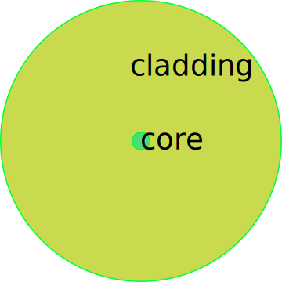

## Physical Background

Optical fiber is a fibrous solid used to transmit light in a certain frequency range. A typical model of the end face of a simple step-index fiber without coating is shown in the figure. It is a two-layer structure. The inner layer is called core with higher refractive index, and the outer layer is called the cladding with lower refractive index. For a single-mode fiber, the relative refractive index difference between the two layers is generally 0.02~0.005.

With the advancement of technology, manufacturers can produce optical fibers for a variety of different purposes, for example, graded-index fiber for optimized transmission, photonic crystal fiber for high coupling efficiency. 

## Codes

**This page corresponds to the module `fiber`** 

### Classes

#### 1. Fiber

In optical applications, three properties, $n_f$ (core refractive index), $\lambda$ (wavelength of transmitted light), and $\omega_f$ (radius of mode field), of the fiber must be considered. Any qualified manufacturer is fully capable of providing these data. 

----

<strong class="object" id="Fiber">Fiber</strong>: `class Fiber(misc.Wavelength)`

This class define a fiber end face object. Almost all attributes cannot be assigned by `self.attr = value`.

attributes:

- modifiable_properties - This attribute is set to `modifiable_properties = ('nf', 'wavelength', 'omegaf')` where
  - nf - $n_f$, core refractive index
  - wavelength - $\lambda$, wavelength of transmitted light
  - omegaf - $\omega_f$, radius of mode field of fiber
  
- name - The name of instances or classes. The default is *Fiber*, which can be modified as required. 

- property_set -  Property collection, which is an instance of `PropertySet`, inherited from `_utils.Object`. See [introduction](introduction.md) for details.

- The following attributes are all decorated by `@property`, which cannot be assigned directly. Some properties are provided by the parent class.

  - properties provided by this class

    - nf - $n_f$, core refractive index
    - omegaf - $\omega_f$, radius of mode field of fiber
  
- properties provided by parent class
  
  - see <a class="module-object-refer">misc.Wavelength</a> for details

methods:

- \_\_init\_\_(name='Fiber', \*\*kwargs)  - Create a `Fiber` object by named parameters consistent with modifiable_properties. 

- See <a class="module-object-refer">misc.Wavelength</a>, <a class="module-object-refer-to" module="introduction">Object</a> from [introduction](introduction.md) for other methods.

----

<strong class="object" id="StepIndexFiber">StepIndexFiber</strong>: `class StepIndexFiber(Fiber)`

This class is a subclass of `Fiber` and particularly used to describe a step-index fiber.

attributes:

- modifiable_properties - This attribute is set to `modifiable_properties = ('nf', 'wavelength', 'a', 'naf')` where
  
  - nf - $n_f$, core refractive index
  - wavelength - $\lambda$, wavelength of transmitted light
  - a - $a$, radius of fiber core
  - naf - $NA_f$, numerical aperture
  
- name - The name of instances or classes. The default is *StepIndexFiber*, which can be modified as required.

- property_set -  Property collection, which is an instance of `PropertySet`, inherited from `_utils.Object`. See [introduction](introduction.md) for details.

- The following attributes are all decorated by `@property`, which cannot be assigned directly. Some properties are provided by the parent class.

  - properties provided by this class
  
    - a - $a$, radius of fiber core
    - naf - $NA_f$, numerical aperture. the numerical aperture by definition is given by $NA_{f}=\sqrt{n^2_{\text{core}}-n^2_{\text{clad}}}$.
    - omegaf - $\omega_f$, radius of mode field of fiber. For the step-index fiber, we can compute $\omega_f$ by approximation of Gaussian light. 
      $$
      \omega_f=a(0.65 +1.619V^{-1.5}+2.879V^{-6})
      $$
      for $V\gtrsim 1.2$ where
      $$
      V=\frac{2\pi a}{\lambda}\cdot NA_{f}
      $$
      is the normalized frequency. This is an empirical formula given by Marcuse<a class="refer">[2]</a>. The normalized frequency of single-mode fiber satisfies $V<2.405$.

  - properties provided by parent class

    - see <a class="module-object-refer-to" module="fiber">Fiber</a> for details

methods:

- \_\_init\_\_(name='StepIndexFiber', \*\*kwargs)  - Create a `StepIndexFiber` object by named parameters consistent with modifiable_properties. 

- See <a class="module-object-refer-to" module="fiber">Fiber</a>, <a class="module-object-refer-to" module="introduction">Object</a> from [introduction](introduction.md) for other methods.

----

## Examples

## References

[1]: W. B. Joyce and B. C. DeLoach, "[Alignment of Gaussian beams](_assets/paper/alignment_of_gaussian_beams.pdf ':ignore :target=_blank :class=download')," APPLIED OPTICS 23, 23 (1984).

[2]: D. Marcuse, "Loss Analysis of Single-Mode Fiber Splices," Bell Syst. Tech. J. 56, 703 (1977).

