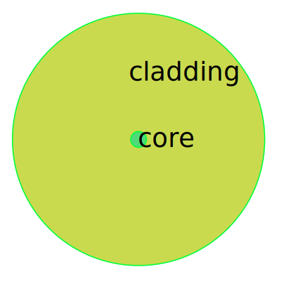

## Physical Background

Optical fiber is a fibrous solid used to transmit light in a certain frequency range. A typical model of the end face of a simple step-index fiber without coating is shown in the figure.

It is a two-layer structure. The inner layer is called the core which is made of a material with higher refractive index, and the outer layer is called the cladding which is made of a material with lower refractive index. For a single-mode fiber, the relative refractive index difference between the two layers is generally 0.02~0.005.

With the advancement of technology, manufacturers can produce optical fibers for a variety of different purposes, for example, graded-index fiber for optimized transmission, photonic crystal fiber for high coupling efficiency. 

For the application of fiber coupling, three properties (core refractive index, transmission wavelength, and mode field radius) of the fiber must be considered. Any qualified manufacturer is fully capable of providing these data.

## Codes

**This page corresponds to the module `cavag.fiber`** 

### Classes

- **Fiber**
- **StepFiber**

### Examples

