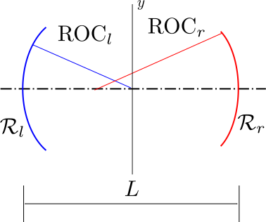

## Physical Background

F-P (Fabry-Perot) cavity is a passive optical resonant cavity. It was first produced in 1897 and invented by the French Charles Fabry and Alfred Perot. It has been widely used in the fields of optical communication, laser and spectroscopy to control or measure light wavelengths. The traditional F-P cavity is composed of two parallel plates with a certain reflectivity, that is, a plane parallel cavity. Currently commonly used scanning F-P cavity interferometers usually use spherical mirrors to reduce adjustment difficulty and improve system stability with a confocal cavity structure. 

In the field of microcavity, we use F-P cavity to describe all optical resonant cavities with similar structures, not just to describe parallel plates. Optical resonators in that field are often composed of plano-concave high-reflection mirrors or double-concave high-reflection mirrors, with their reflectivity higher than or even far higher than $99\%$. The fineness of such a highly reflective cavity is higher than $1000$.

Left figure shows a typical optical resonant cavity, with cavity length $L$, radius of curvature of left cavity mirror $\text{ROC}_l$, reflectivity of left cavity mirror $\mathcal{R}_l$, radius of curvature of right cavity mirror $\text{ROC}_r$, reflectivity of right cavity mirror $\mathcal{R}_r$. According to the symbol rules in most reference materials, $\text{ROC}>0$ when the concave surface faces the inside of the cavity (concave mirror), and $\text{ROC}<0$ when the convex surface faces the inside of the cavity (convex mirror). So in the picture above, $\text{ROC}_l,\text{ROC}_r>0$.

A stable cavity must satisfy the requirement that the paraxial mode travels infinitely many times without leaving the cavity, that is, the geometric optical loss of the paraxial light is zero. And the mathematical expression of that requirement is
$$
0\le g_l g_r\le1 \tag{1}
$$
where $g_l,g_r$ are defined by
$$
g_l=1-\frac{L}{\text{ROC}_l}\quad g_r=1-\frac{L}{\text{ROC}_r} \tag{2}
$$
When $0<g_l g_r<1$, the cavity must be stable. But when $g_l g_r=0$ or $g_l g_r=1$, the stability of this cavity, which is also called critical cavity, is determined by its structure. For a stable cavity structure, the cavity has the following properties:

Ralei length $z_0$,
$$
z_0=L\sqrt{\frac{g_lg_r(1-g_lg_r)}{(g_l+g_r-2g_lg_r)^2}} \tag{3}
$$
The position of the left cavity surface relative to the waist $p_l$,
$$
p_l=L\frac{g_r(1-g_l)}{g_l+g_r-2g_lg_r} \tag{4}
$$
The position of the right cavity surface relative to the waist $p_r$,
$$
p_r=L\frac{g_l(1-g_r)}{g_l+g_r-2g_lg_r} \tag{5}
$$
If the center position of the cavity is set to the origin, then the waist position $p_0$,
$$
p_0=\frac{p_l-p_r}{2} \tag{6}
$$
The $\text{FSR}$ (Free Spectral Range) is given by
$$
\text{FSR} = \frac{2\pi c}{2 n_c L} \tag{7}
$$
where $n_c$ is the refractive index of the medium in the cavity. Generally, this medium is air, that is, $n_c=1$. Different from the definition in other reference books, this definition of $\text{FSR}$ above is an angular frequency.

The width of the cavity resonances, usually expressed as full-width at half-maximum (FWHM) frequency $\delta\nu$ in laser physics and as half-width at half-maximum (HWHM) angular frequency<a class="refer">[1]</a>
$$
\kappa = \frac{2\pi \delta\nu}{2}\approx\frac{c[2-(1-\mathcal{L}_c)(\mathcal{R}_l+\mathcal{R}_r)]}{4n_c L} \tag{8}
$$
where $\mathcal{L}_c$ is single-pass effective cavity loss, and $2-(1-\mathcal{L}_c)(\mathcal{R}_l+\mathcal{R}_r)$ is the round-trip loss. The above approximation only holds when the cavity loss $\mathcal{L}_c$ is very small and the reflectivity of the mirror $\mathcal{R}_l$, $\mathcal{R}_r$ are very large.

The cavity finesse is defined by
$$
\begin{aligned}
\text{finesse}&=\frac{\text{FSR}}{2\pi \delta\nu}=\frac{\text{FSR}}{2\kappa}\\
&=\frac{\pi\sqrt{1-\mathcal{L}_c}\sqrt[4]{\mathcal{R}_l \mathcal{R}_r}}{\sqrt{[1+(1-\mathcal{L}_c)\sqrt{\mathcal{R}_l \mathcal{R}_r}]^2-2(1-\mathcal{L}_c)(\mathcal{R}_l+\mathcal{R}_r)}}\\
&\approx\frac{2\pi}{2-(1-\mathcal{L}_c)(\mathcal{R}_l+\mathcal{R}_r)}
\end{aligned} \tag{9}
$$
The quality factor $Q$ of the cavity is defined by
$$
Q=\frac{\nu}{\delta\nu} \tag{10}
$$
!> Please note that some of the above symbols may be different from other reference books.

There are many ways to define the modal volume of a cavity, one of the most convenient is defined as
$$
\begin{aligned}
V&=\frac{\int_V \mathbf{\epsilon}(\mathbf{r})|\mathbf{E}(\mathbf{r})|^2d^3 \mathbf{r}}{\max_{V}[\mathbf{\epsilon}(\mathbf{r})|\mathbf{E}(\mathbf{r})|^2]}\approx \frac{\int_{V}|u(\mathbf{r})|^2 d^3 \mathbf{r}}{\max_{V}|u(\mathbf{r})|^2}\\
&=\frac{L/2}{\max_{V}|u(\mathbf{r})|^2}
\end{aligned} \tag{11}
$$

where
$$
u(\mathbf{r})=u_{mn}(x,y,z)\cos(kz)
$$
for a standing wave Hermite-Gauss field with  $m,n$ mode. See [gaussbeam](gaussbeam.md) for more details.

?where $u(\mathbf{r})$ is the Hermite-Gauss mode $=\frac{1}{4}\pi\omega_0^2L $.?

There are a lot of losses in the cavity, and a lot of losses are on the mirror surface, mainly including:

Clipping loss on the finite-diameter mirrors. Conservatively assume a cavity mode and consider its 'spillover' loss upon reflection on a finite-diameter mirror. For a single reflection,
$$
\mathcal{L}_{cl}=e^{-2(D/2)^2/\omega_m^2} \tag{12}
$$
where $\omega_{m}$ is the mode radius of the mode impinging on the mirror of diameter $D$. Note the mode radius of higher-order modes is larger, so the clipping loss is larger under the same parameters.

Scattering loss. A widely used estimate linking the roughness of the mirror surface to the scattering loss is
$$
\mathcal{L}_{sc}=\left(\frac{4\pi \sigma_{sc}}{\lambda}\right)^2 \tag{13}
$$
where $\sigma_{sc}$ is the roughness of the surface, which is consistent with the definition of surface roughness in the field of mechanical manufacturing, a typical value is $0.2\text{nm}$. Better mirror manufacturing technology and coating technology can effectively reduce $\sigma_{sc}$, thereby reducing $\mathcal{L}_{sc}$.

## Codes

### Classes

### Functions

## Examples

## References

[1]: D Hunger et al "[A fiber Fabry–Perot cavity with high finesse](_assets/paper/Hunger_A_fiber_Fabry–Perot_cavity_with_high_finesse.pdf ':ignore :target=_blank')," *New J. Phys.* **12** 065038 (2010)