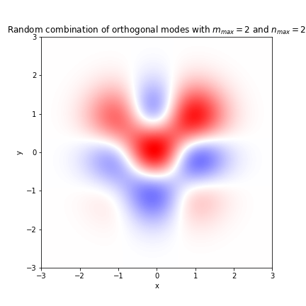
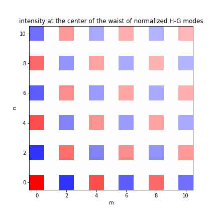

## Physical Background

The normalized Gaussian Beam or more general Hermite-Gaussian Beam has form
$$
\begin{aligned}
u_{mn}(x,y,z)=&\frac{C_{mn}}{\sqrt{1+z^2/z_R^2}}\psi_{m}\left(\frac{\sqrt{2}x}{w}\right)\psi_{n}\left(\frac{\sqrt{2}y}{w}\right)\\
&\cdot \exp\left[-\frac{jk}{2R}(x^2+y^2)\right]e^{j(m+n+1)\phi}
\end{aligned} \tag{1}
$$
for $m,n=0,1,2,\dots$, where $z_R=\pi w_0^2/\lambda$ which also called by Rayleigh length or Rayleigh range, and
$$
R=R(z)=z\left[1+\left(\frac{z_R}{z}\right)^2\right] \tag{2}
$$

$$
w=w(z)=w_0\left[1+\left(\frac{z}{z_R}\right)^2\right]^{1/2} \tag{3}
$$

$$
\tan\phi=\frac{z}{z_R} \tag{4}
$$

the normalization factor is given by
$$
C_{mn}=\left(\frac{2}{w_0^2 \pi 2^{m+n}m! n!}\right)^{1/2}
$$
Note $\psi_m(\xi)=H_m(\xi)e^{-\xi^2/2}$ is the $m$th order Hermite-Gaussian mode to equation
$$
-\frac{d^2 \psi_m}{d \xi^2}+\xi^2 \psi_m = \lambda_m \psi_m
$$
with eigenvalue $\lambda_m=2(m+1/2)$. The normalization factor $C_m$ of $\psi_m(\xi)$ is given by
$$
C_m=\frac{1}{\pi^{1/4}\sqrt{2^m m!}}
$$
with identity $\int^{\infty}_{-\infty}H^2_m(\xi)e^{-\xi^2}d\xi=\sqrt{\pi} 2^m m!$. At $z=0$, we can get the shape of the waist
$$
u_{mn}(x_0,y_0)=C_{mn}\psi_{m}\left(\frac{\sqrt{2}x_0}{w_0}\right)\psi_{n}\left(\frac{\sqrt{2}y_0}{w_0}\right) \tag{5}
$$
$C_{mn}$ can be chosen so that $\int^{\infty}_{-\infty}dx_0 \int^{\infty}_{-\infty}dy_0 |u_{mn}(x_0,y_0)|^2=1$. The Hermite-Gaussian forward traveling wave can also be computed by
$$
\begin{aligned}
u_{mn}(x,y,z)=&\frac{j}{\lambda z}\int^{\infty}_{-\infty}dx_0\int^{\infty}_{-\infty}dy_0 u_{mn}(x_0,y_0)\\
&\cdot\exp\left\{-\frac{jk}{2z}[(x-x_0)^2+(y-y_0)^2]\right\}
\end{aligned}
$$

**demonstration of the characteristics of Hermite-Gaussian Modes**

The figure on the left shows the waist shape of some modes. It is easy to find that although the equation (3) is equivalently satisfied for each mode, the beam waist of different modes cannot be represented by $w_0$ only, and only the waist radius of fundamental Gaussian mode can be represented by $w_0$.

In addition, as $m$ or $n$ increases, the number of nodes increases and the range of the waist becomes larger and larger. 

The most commonly used laser is the fundamental mode of Hermite-Gaussian beam, that is, $m=n=0$. The equation of the waist of fundamental mode is given by
$$
u_{mn}(x_0,y_0)=\left(\frac{2}{w_0^2 \pi}\right)^{1/2}\exp\left(-\frac{x_0^2+y_0^2}{w_0^2}\right)
$$

A waist of a random combinations of some mode are shown in the first figure above. It can be seen that the graph of a random combination of the Hermite-Gaussian modes becomes very weird. Using the orthogonality of the Hermite-Gaussian modes can we expand this graph. And the second figure shows the intensity at the center of the waist of each normalized Hermite-Gaussian mode. We also find an oscillation characteristic in this figure.

The above pictures can be obtained from the notebook [hermite_gaussian_beam.ipynb](_assets/example/hermite_gaussian_beam.ipynb ':ignore :class=download').

## Codes

**This page corresponds to the module `gaussbeam`**

### Classes

### Functions

## Examples

