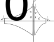
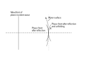

## Physical Background

### Definition of Hermite-Gaussian Beam

The normalized Gaussian Beam or more general Hermite-Gaussian Beam has form
$$
\begin{aligned}
&f_{mn}(x,y,z,t)\\&=u_{mn}(x,y,z)e^{-jkz}e^{j2\pi \nu t}
\end{aligned} \tag{1}
$$
where
$$
\begin{aligned}
&u_{mn}(x,y,z)\\
&=\frac{C_{mn}}{\sqrt{1+z^2/z_R^2}}\\
&\;\cdot\psi_{m}\left(\frac{\sqrt{2}x}{\omega}\right)\psi_{n}\left(\frac{\sqrt{2}y}{\omega}\right)\\
&\;\cdot \exp\left[-\frac{jk}{2R}(x^2+y^2)\right]\\
&\;\cdot e^{j(m+n+1)\phi}
\end{aligned} \tag{2}
$$
for $m,n=0,1,2,\dots$, where 
$$
z_R=\pi \omega_0^2/\lambda  \tag{3}
$$
 which also called by Rayleigh length or Rayleigh range, and
$$
R=R(z)=z\left[1+\left(\frac{z_R}{z}\right)^2\right] \tag{4}
$$

$$
\omega=\omega(z)=\omega_0\left[1+\left(\frac{z}{z_R}\right)^2\right]^{1/2} \tag{5}
$$

$$
\tan\phi=\frac{z}{z_R} \tag{6}
$$

the normalization factor is given by
$$
C_{mn}=\left(\frac{2}{\omega_0^2 \pi 2^{m+n}m! n!}\right)^{1/2}
$$
And note $\psi_m(\xi)=H_m(\xi)e^{-\xi^2/2}$ is the $m$th order Hermite-Gaussian mode to equation
$$
-\frac{d^2 \psi_m}{d \xi^2}+\xi^2 \psi_m = \lambda_m \psi_m
$$
with eigenvalue $\lambda_m=2(m+1/2)$. The normalization factor $C_m$ of $\psi_m(\xi)$ is given by
$$
C_m=\frac{1}{\pi^{1/4}\sqrt{2^m m!}}
$$
with identity $\int^{\infty}_{-\infty}H^2_m(\xi)e^{-\xi^2}d\xi=\sqrt{\pi} 2^m m!$. At $z=0$, we can get the shape of the waist
$$
\begin{aligned}
&u_{mn}(x_0,y_0)\\
&=C_{mn}\psi_{m}\left(\frac{\sqrt{2}x_0}{\omega_0}\right)\psi_{n}\left(\frac{\sqrt{2}y_0}{\omega_0}\right)
\end{aligned} \tag{7}
$$
$C_{mn}$ can be chosen so that $\int^{\infty}_{-\infty}dx_0 \int^{\infty}_{-\infty}dy_0 |u_{mn}(x_0,y_0)|^2=1$. The Hermite-Gaussian forward traveling wave can also be computed by
$$
\begin{aligned}
&u_{mn}(x,y,z)\\
&=\frac{j}{\lambda z}\int^{\infty}_{-\infty}dx_0\int^{\infty}_{-\infty}dy_0 u_{mn}(x_0,y_0)\\
&\;\cdot\exp\left\{-\frac{jk}{2z}[(x-x_0)^2+(y-y_0)^2]\right\}
\end{aligned}
$$

Through Maxwell’s equations, 
$$
\begin{aligned}
\mu \mathbf{H} &= \nabla \times \mathbf{A}\\
\mathbf{E} &= -j2\pi\nu \nabla \times \mathbf{A}-\nabla\Phi\\
\end{aligned}
$$
where $\Phi$ in an environment without charged particles, is
$$
\Phi=\frac{j}{2\pi\nu \mu\epsilon}\nabla \cdot \mathbf{A}
$$
Suppose that $\mathbf{A}$ is polarized along $\hat{\mathbf{x}}$:
$$
\mathbf{A}=\hat{\mathbf{x}}u_{mn}(x,y,z)e^{-jkz}
$$
Then
$$
\begin{aligned}
\mathbf{E} &= -j2\pi\nu \left(\hat{\mathbf{x}}u_{mn}-j\hat{\mathbf{z}}\frac{\partial u_{mn}}{k\partial x} \right)e^{-jkz}\\
\mu \mathbf{H} &= -jk\left(\hat{\mathbf{y}}u_{mn}-j\hat{\mathbf{z}}\frac{\partial u_{mn}}{k\partial y} \right)e^{-jkz}
\end{aligned} \tag{8}
$$

#### Characteristics of Gaussian mode

The most commonly used laser is the fundamental mode of Hermite-Gaussian beam, that is, $m=n=0$. The equation of the fundamental Gaussian mode is given by
$$
\begin{aligned}
&u_{00}(x_0,y_0)\\
&=\left(\frac{2}{\omega_0^2 \pi}\right)^{1/2}\exp\left(-\frac{x_0^2+y_0^2}{\omega_0^2}\right) 
\end{aligned} \tag{9}
$$
And the equation $(5)$ also shows that
$$
\frac{\omega^2(z)}{\omega_0^2}-\frac{z^2}{z_R^2}=1
$$
So the asymptotic straight line of above equation gives divergence half angle $\theta_{0}$ of Gaussian mode
$$
\tan\theta_{0}=\frac{\omega_0}{z_R}=\frac{\lambda}{\pi \omega_0} \tag{10}
$$
Since the fiber is axis-symmetric, the divergence full angle should be $2\theta_{0}$. In some textbooks, the mode volume of the Gaussian mode is given by

$$
\begin{aligned}
V_{00eff}=&\int^{z_2}_{z_1}\pi\omega_0^2\left[1+\left(\frac{z}{z_R}\right)^2\right]dz\\
=&\pi\omega_0^2\left[z_2-z_1+\frac{1}{3z_R^2}\left(z_2^3-z_1^3\right)\right]
\end{aligned} \tag{11}
$$

#### Characteristics of Hermite-Gaussian mode

The waist radius of $x$-direction of a Hermite-Gaussian mode is
$$
\omega_{m}=\sqrt{2m+1}\omega_0 \tag{12}
$$
and the half divergence angle of this direction is
$$
\theta_{m}=\sqrt{2m+1}\theta_{0} \tag{13}
$$
The mode volume of the Hermite-Gaussian mode is
$$
V_{mneff}=\sqrt{(2m+1)(2n+1)}V_{00eff} \tag{14}
$$
where $V_{00eff}$ is the mode volume of the fundamental mode at the same location.

### Demonstration of the characteristics of Hermite-Gaussian Modes

The figure on the left shows the waist shape of some modes. It is easy to find that although the equation $(3)$ is equivalently satisfied for each mode, the beam waist of different modes cannot be represented by $\omega_0$ only, and only the waist radius of fundamental Gaussian mode can be represented by $\omega_0$.

In addition, as $m$ or $n$ increases, the number of nodes increases and the range of the waist becomes larger and larger. 

A waist of a random combinations of some mode are shown in this figure. It can be seen that the graph of a random combination of the Hermite-Gaussian modes becomes very weird. 

The state shown in the figure is a superposition state of multiple Hermite-Gaussian modes, that is
$$
u(x,y,z) = \sum_{m,n}u_{mn}(x,y,z)
$$
Note the intensity of this mode satisfies
$$
I(x,y,z)\propto \|u(x,y,z)\|^2=\left\|\sum_{m,n}u_{mn}(x,y,z)\right\|^2\ne\sum_{m,n}\left\|u_{mn}(x,y,z)\right\|^2
$$
The final inequality represents a typical difference between classical and quantum 

Using the orthogonality of the Hermite-Gaussian modes can we expand this graph. And the second figure shows the intensity at the center of the waist of each normalized Hermite-Gaussian mode. We also find an oscillation characteristic in this figure.

The above pictures can be obtained from the notebook [hermite_gaussian_beam.ipynb](_assets/example/hermite_gaussian_beam.ipynb ':ignore :class=download').

### Transformation of Hermite-Gaussian Modes

#### Transformation by a thin lens

!> Please note that the definition of the symbol here is slightly different from elsewhere.

With the characteristics of Hermite-Gaussian beams and the notation in the figure, we get
$$
\begin{aligned}
&\omega = \omega_0\left[1+\left(\frac{\lambda s}{\pi{\omega_0}^2}\right)^2\right]^{1/2} \\
& R= s\left[1+\left(\frac{\pi \omega_0^2}{\lambda s}\right)^2\right] 
\end{aligned} \tag{15}
$$
and
$$
\begin{aligned}
&\omega'_0 = \frac{\omega'}{\left[1+\left(\frac{\pi{\omega'}^2}{\lambda R'}\right)^2\right]^{1/2}}\\
&s' =  \frac{R'}{1+\left(\frac{\lambda R'}{\pi{\omega'}^2}\right)^2} 
\end{aligned} \tag{16}
$$
With our notations, features of the thin lens imply that
$$
\omega' = \omega \ \text{and} \ \frac{1}{R'}-\frac{1}{R} = \frac{1}{f'}  \tag{17}
$$
Then with the order following
$$
\begin{aligned}
& (\omega_0,s)\overset{(15)}\rightarrow (\omega,R) \\
& \overset{(17)}\rightarrow(\omega',R')\overset{(16)}\rightarrow(\omega'_0,s')
\end{aligned}
$$
one can get radius and position of the waist of the Gaussian beam after passing through the thin lens. This is the same for any mode of Hermite-Gaussian.

#### Transformation by a mirror

A mirror of radius $R_0$ reflects the beam and changes the radius of curvature of the phase front. If we unfold the beam, we find that the incident phase delay $k(x^2+y^2)/(2R)$ is advanced by $2[k(x^2+y^2)/(2R_0)]$ because the path is shortened twice. Thus $R'$ of the unfolded reflected beam is given by
$$
\frac{1}{R'}=\frac{1}{R}-\frac{2}{R_0}
$$
A unfolded mirror acts like a lens with a focal distance $f'=R_0/2$.

If we move the origin of the coordinates to the position of the mirror surface, change the definition of symbols, then the features of unfold mirror gives

!> The definitions of symbols $R',R,R_0$ have changed.

With our notations, features of the mirror imply that
$$
\omega' = \omega \ \text{and} \ \frac{1}{R'}-\frac{1}{R} = \frac{2}{R_0}  \tag{18}
$$
Then the waist position and waist radius of the beam after reflection can be calculated by the following steps
$$
\begin{aligned}
&(\omega_0,s)\overset{(15)}\rightarrow (\omega,R) \overset{(18)}\rightarrow(\omega',R')\\
&\overset{(16)}\rightarrow(\omega'_0,s')\overset{z\rightarrow -z}\rightarrow(\omega'_0,-s')
\end{aligned}
$$
In the last expression, the optical axis has undergone an axis-symmetric transformation with respect to the vertical axis. At this time, all parameters in the Gaussian beam should be calculated in the new optical axis. 

#### Transformation by a general linear system

A Gaussian beam is completely

## Codes

**This page corresponds to the module `gaussbeam`**

### Classes

### Functions

## Examples

## References

[1]: Hermann A. Haus, "[WAVES AND FIELDS IN OPTOELECTRONICS](_assets/paper/waves-and-fields-in-optoelectronics.djvu ":ignore :class=download")," Prentice-Hall, Inc., Englewood Cliffs, New Jersey 07632.