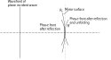

## Physical Background

### Definition of Hermite-Gaussian Beam

The normalized Gaussian Beam or more general Hermite-Gaussian Beam has form
$$
f_{mn}(x,y,z)=u_{mn}(x,y,z)e^{-jkz}  \tag{1}
$$
where
$$
\begin{aligned}
u_{mn}(x,y,z)=&\frac{C_{mn}}{\sqrt{1+z^2/z_R^2}}\psi_{m}\left(\frac{\sqrt{2}x}{\omega}\right)\psi_{n}\left(\frac{\sqrt{2}y}{\omega}\right)\\
&\cdot \exp\left[-\frac{jk}{2R}(x^2+y^2)\right]e^{j(m+n+1)\phi}
\end{aligned} \tag{2}
$$
for $m,n=0,1,2,\dots$, where 
$$
z_R=\pi \omega_0^2/\lambda  \tag{3}
$$
 which also called by Rayleigh length or Rayleigh range, and
$$
R=R(z)=z\left[1+\left(\frac{z_R}{z}\right)^2\right] \tag{4}
$$

$$
\omega=\omega(z)=\omega_0\left[1+\left(\frac{z}{z_R}\right)^2\right]^{1/2} \tag{5}
$$

$$
\tan\phi=\frac{z}{z_R} \tag{6}
$$

the normalization factor is given by
$$
C_{mn}=\left(\frac{2}{\omega_0^2 \pi 2^{m+n}m! n!}\right)^{1/2}
$$
The equation $(5)$ also shows that
$$
\frac{\omega^2(z)}{\omega_0^2}-\frac{z^2}{z_R^2}=1
$$
So the asymptotic straight line of above equation gives half divergence angle $\theta$
$$
\tan\theta=\frac{\omega_0}{z_R}=\frac{\lambda}{\pi \omega_0} \tag{7}
$$
Since the fiber is axis-symmetric, the actual divergence angle should be $2\theta$. And note $\psi_m(\xi)=H_m(\xi)e^{-\xi^2/2}$ is the $m$th order Hermite-Gaussian mode to equation
$$
-\frac{d^2 \psi_m}{d \xi^2}+\xi^2 \psi_m = \lambda_m \psi_m
$$
with eigenvalue $\lambda_m=2(m+1/2)$. The normalization factor $C_m$ of $\psi_m(\xi)$ is given by
$$
C_m=\frac{1}{\pi^{1/4}\sqrt{2^m m!}}
$$
with identity $\int^{\infty}_{-\infty}H^2_m(\xi)e^{-\xi^2}d\xi=\sqrt{\pi} 2^m m!$. At $z=0$, we can get the shape of the waist
$$
u_{mn}(x_0,y_0)=C_{mn}\psi_{m}\left(\frac{\sqrt{2}x_0}{\omega_0}\right)\psi_{n}\left(\frac{\sqrt{2}y_0}{\omega_0}\right) \tag{8}
$$
$C_{mn}$ can be chosen so that $\int^{\infty}_{-\infty}dx_0 \int^{\infty}_{-\infty}dy_0 |u_{mn}(x_0,y_0)|^2=1$. The Hermite-Gaussian forward traveling wave can also be computed by
$$
\begin{aligned}
u_{mn}(x,y,z)=&\frac{j}{\lambda z}\int^{\infty}_{-\infty}dx_0\int^{\infty}_{-\infty}dy_0 u_{mn}(x_0,y_0)\\
&\cdot\exp\left\{-\frac{jk}{2z}[(x-x_0)^2+(y-y_0)^2]\right\}
\end{aligned}
$$

### Demonstration of the characteristics of Hermite-Gaussian Modes

The figure on the left shows the waist shape of some modes. It is easy to find that although the equation (3) is equivalently satisfied for each mode, the beam waist of different modes cannot be represented by $\omega_0$ only, and only the waist radius of fundamental Gaussian mode can be represented by $\omega_0$.

In addition, as $m$ or $n$ increases, the number of nodes increases and the range of the waist becomes larger and larger. 

The most commonly used laser is the fundamental mode of Hermite-Gaussian beam, that is, $m=n=0$. The equation of the waist of fundamental mode is given by
$$
u_{mn}(x_0,y_0)=\left(\frac{2}{\omega_0^2 \pi}\right)^{1/2}\exp\left(-\frac{x_0^2+y_0^2}{\omega_0^2}\right) \tag{9}
$$

A waist of a random combinations of some mode are shown in the first figure above. It can be seen that the graph of a random combination of the Hermite-Gaussian modes becomes very weird. Using the orthogonality of the Hermite-Gaussian modes can we expand this graph. And the second figure shows the intensity at the center of the waist of each normalized Hermite-Gaussian mode. We also find an oscillation characteristic in this figure.

The above pictures can be obtained from the notebook [hermite_gaussian_beam.ipynb](_assets/example/hermite_gaussian_beam.ipynb ':ignore :class=download').

### transformation of Hermite-Gaussian Modes

**transformation by a thin lens**

!> Please note that the definition of the symbol here is slightly different from elsewhere.

With the characteristics of Gaussian beams and the notation in the figure, we get
$$
\omega = \omega_0\left[1+\left(\frac{\lambda s}{\pi{\omega_0}^2}\right)^2\right]^{1/2}, \ R= s\left[1+\left(\frac{\pi \omega_0^2}{\lambda s}\right)^2\right] \tag{10}
$$
and
$$
\omega'_0 = \frac{\omega'}{\left[1+\left(\frac{\pi{\omega'}^2}{\lambda R'}\right)^2\right]^{1/2}}, \ s' =  \frac{R'}{1+\left(\frac{\lambda R'}{\pi{\omega'}^2}\right)^2}  \tag{11}
$$
With our notations, the features of thin lens imply that
$$
\omega' = \omega \ \text{and} \ \frac{1}{R'}-\frac{1}{R} = \frac{1}{f'}  \tag{12}
$$
Then with the order following
$$
(\omega_0,s)\overset{(10)}\rightarrow (\omega,R) \overset{(12)}\rightarrow(\omega',R')\overset{(11)}\rightarrow(\omega'_0,s')
$$
one can get radius and position of the waist of the Gaussian beam after passing through the thin lens.

**transformation by a mirror**

A mirror of radius $R_0$ reflects the beam and changes the radius of curvature of the phase front. If we unfold the beam, we find that the incident phase delay $k(x^2+y^2)/(2R)$ is advanced by $2[k(x^2+y^2)/(2R_0)]$ because the path is shortened twice. Thus $R'$ of the unfolded reflected beam is given by
$$
\frac{1}{R'}=\frac{1}{R}-\frac{2}{R_0}
$$
A unfolded mirror acts like a lens with a focal distance $f'=R_0/2$.

If we move the origin of the coordinates to the position of the mirror surface, change the definition of symbols, then the features of unfold mirror gives

!> The definitions of symbols $R',R,R_0$ have changed.
$$
\omega' = \omega \ \text{and} \ \frac{1}{R'}-\frac{1}{R} = \frac{2}{R_0}  \tag{13}
$$
With equation $(10)$ and $(11)$, then the beam waist position and radius of the beam after reflection can be calculated by the following steps
$$
(\omega_0,s)\overset{(10)}\rightarrow (\omega,R) \overset{(13)}\rightarrow(\omega',R')\overset{(11)}\rightarrow(\omega'_0,s')\overset{z\rightarrow -z}\rightarrow(\omega'_0,-s')
$$
In the last expression, the optical axis has undergone an axis-symmetric transformation with respect to the vertical axis. At this time, all parameters in the Gaussian beam should be calculated in the new optical axis. 

## Codes

**This page corresponds to the module `gaussbeam`**

### Classes

### Functions

## Examples

## References

[1]: Hermann A. Haus, "[WAVES AND FIELDS IN OPTOELECTRONICS](_assets/paper/waves-and-fields-in-optoelectronics.djvu ":ignore :class=download")," Prentice-Hall, Inc., Englewood Cliffs, New Jersey 07632.