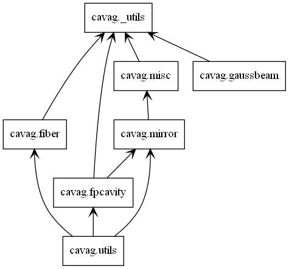

The modules in cavag are organized as shown below

**Module Content:**

<!-- tabs:start -->

<!-- tab:fiber -->

Source Page: [fiber](fiber.md)

**Class[es]**

- `FiberEnd`
- `StepIndexFiberEnd`

<!-- tab:fpcavity -->

Source Page: [fpcavity](fpcavity)

<!-- tab:gaussbeam -->

Source Page: [gaussbeam](gaussbeam.md)

<!-- tab:mirror -->

Source Page: [mirror](mirror.md)

**Class[es]**

- `MirrorSurface`
- `RTLConverter`
- `ThickLens`
- `ThinLens`

<!-- tab:misc -->

Source Page: [misc](misc.md) 

<!-- tab:utils -->

Source Page: [utils](utils.md)

<!-- tabs:end -->

The core functions of cavag are provided by `Object` and `PropertySet` in *_utils.py*. The UML diagram of this file is shown below

In other modules, all abstract classes related to physical objects are subclasses of `PrintableObject`. A mature subclass needs to define its own **modifiable_properties** class attribute, which can be used in class method `cls.filter_properties(kwargs)` to filter modifiable physical properties in the dict, kwargs. In general, **modifiable_properties** contains the names of all input parameters defined in the constructor of the subclass, other than the name.

An empty **property_set** is created if the subclass is constructed. It is a data type similar to the python dict. One can get and set the value corresponding to key by `value = property_set[key]` and `property_set[key] = value`. The private attribute **__required_props** of **property_set** is a set, when an instance of `PropertySet` is created, this attribute will be set to `set(props)` where props is the input parameter of the constructor \_\_init\_\_(props=(), \*args, \*\*kwargs). **__required_props** contains all basic properties  that a physical object must have, and all other properties can be derived from these basic properties. These basic properties are initialized to `None`. The value of the property in **__required_props** can be normally obtained through `property_set[prop]`, but if the value of this property is `None`, obtaining the corresponding value through `property_set.get_strictly(prop)` will raise a `PropertyLost` exception.

