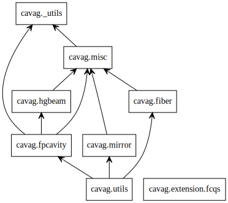

### Modules

The modules in `cavag` are organized as shown below

<div style="text-align: center"></div>

**Module Contents:**

<!-- tabs:start -->

<!-- tab:fiber -->

Source Page: [fiber](fiber.md)

**Class[es]**

- <a class="class-refer-to" module="fiber">FiberEnd</a>
- <a class="class-refer-to" module="fiber">StepIndexFiberEnd</a>

<!-- tab:fpcavity -->

Source Page: [fpcavity](fpcavity)

<!-- tab:gaussbeam -->

Source Page: [gaussbeam](gaussbeam.md)

<!-- tab:mirror -->

Source Page: [mirror](mirror.md)

**Class[es]**

- <a class="class-refer-to" module="mirror">Mirror</a>
- <a class="class-refer-to" module="Lens">Lens</a>

<!-- tab:misc -->

Source Page: [misc](misc.md) 

**Class[es]**

- <a class="class-refer-to" module="misc">RTL</a>
- <a class="class-refer-to" module="misc">RTLConverter</a>
- <a class="class-refer-to" module="misc">Position</a>
- <a class="class-refer-to" module="misc">Wavelength</a>

<!-- tab:utils -->

Source Page: [utils](utils.md)

<!-- tabs:end -->


### Core Implementation

The core functions of `cavag` are provided by `Object` and `PropertySet` in *_utils.py*. The UML diagram of this file is shown below

<div style="text-align: center"></div>

1. **Usage**

In other modules, all abstract classes related to physical objects are subclasses of `PrintableObject`. A mature subclass needs to define its own **modifiable_properties** class attribute, which can be used in class method `cls.filter_properties(propdict)` to filter modifiable physical properties in the `dict`, <font color="red">kwargs</font>. In general, **modifiable_properties** contains the names of all input parameters defined in the constructor of the subclass, other than the <font color="red">name</font>.

An empty **property_set** is created if the subclass is constructed. It is a data type similar to the python `dict`. One can get and set the <font color="red">value</font> corresponding to <font color="red">key</font> by `value = property_set[key]` and `property_set[key] = value`. The private attribute **__required_props** of **property_set** is a set, when an instance of `PropertySet` is created, this attribute will be set to `set(props)` where <font color="red">props</font> is the input parameter of the constructor <font color="red">\_\_init\_\_(props=(), \*args, \*\*kwargs)</font>. **__required_props** contains all basic properties that a physical object must have, and all other properties can be derived from these basic properties. These basic properties are initialized to `None`. The value of a property `prop` in **__required_props** can be normally obtained through `property_set[prop]`, but if the value of this property is `None`, obtaining the corresponding value through `property_set.get_strictly(prop)` will raise a `PropertyLost` exception.

The detailed definitions are as follows:

----

<strong id="Object">Object</strong>: `class Object`

This class defines an abstraction of real object.

<font color="blue">The attributes are defined as follows</font>:

- <font color="red">modifiable_properties</font> - Iterable object, contains all the names of modifiable properties.

- <font color="red">name</font> - The name of instances or classes. The default is *Object*, which can be modified as required. 

- <font color="red">property_set</font> - Property collection, which is an instance of `PropertySet`.

<font color="blue">The methods are defined as follows</font>:

- <font color="red">\_\_init\_\_(name="Object", **kwargs)</font> - Create an instance of `Object`, the name is set to be <font color="red">name</font>. In <font color="red">kwargs</font>, only the key name consistent with the property name in <font color="red">modifiable_properties</font> will be set.

- <font color="red">get_property(k, v_f=None)</font> - Use the property name <font color="red">k</font> to get the property value saved in the <font color="red">property_set</font>. If the property does not exist, use the function <font color="red">v_f</font> to calculate its value and save it in the <font color="red">property_set</font>. Then this method use <font color="red">get_strictly</font> of `PropertySet` to get the value of this property. Usually we don't use this method directly, but define a method decorated with `@property` in the subclass, and call the <font color="red">get_property</font> in this method.

- <font color="red">get_proplist()</font> - Get all the method names decorated with `@property` in the class. It is a concrete implementation of an abstract method <font color="red">get_proplist</font> in `PrintInfoMixin`. 

- <font color="red">change_params(\_filter=True, **kwargs)</font> - This method is used to modify the value of parameters in <font color="red">property_set</font>. The input of the method must be named parameters. If <font color="red">\_filter</font> is set to `True`, then only parameters in <font color="red">kwargs</font> consistent with the properties in <font color="red">modifiable_properties</font> will be filtered out by method <font color="red">filter_properties</font>. This method uses <font color="red">update_propset</font> to update <font color="red">property_set</font>. 

- <font color="red">update_propset(**kwargs)</font> - This method directly uses <font color="red">kwargs</font> to update properties in <font color="red">property_set</font> with method <font color="red">change_params</font> of <font color="red">property_set</font>. Note that any key-value pair in <font color="red">kwargs</font> with key starting "\_" will be ignored. Not recommended to use this method directly, use <font color="red">change_params</font> of this class instead.

- <font color="red">filter_properties(propdict)</font> - This method filters the <font color="red">propdict</font> and returns the corresponding sub-dictionary in the <font color="red">propdict</font> with only properties in the <font color="red">modifiable_properties</font>.

----

<strong id="PropertySet">PropertySet</strong>: `class PropertySet(collections.UserDict)`

This class define a data structure which store all properties of a physical object. It is a `dict`-like object, subclass of `collections.UserDict`.

<font color="blue">The attributes are defined as follows</font>:

- <font color="red">\_\_required_props</font> - `set` object, contains all the names of the necessary properties. All the other properties not in <font color="red">\_\_required_props</font> will be cleared when the <font color="red">change_params</font> method of this class is called, see <font color="red">change_params</font> for more details. Only <font color="red">reset_required</font>, <font color="red">add_required</font>, <font color="red">del_required</font>, and <font color="red">clear_required</font> can modify <font color="red">\_\_required_props</font>.

<font color="blue">The methods are defined as follows</font>:

- <font color="red">\_\_init\_\_(required\_props=(), *args, **kwargs)</font> - Create an instance of `PropertySet`. The <font color="red">required\_props</font> is used to set the attribute <font color="red">\_\_required_props</font> of this instance. And <font color="red">args</font>, <font color="red">kwargs</font> are parameters which are consistent with the input parameters of python's `dict`.

- <font color="red">get_strictly(key, default=None)</font> - Similar to method `get(key, default=None)` provided by `collections.UserDict`. But if <font color="red">key</font> is a property in <font color="red">\_\_required_props</font> and the value of this property is `None`, then a `PropertyLost` exception will be raised.

- <font color="red">change_params(**kwargs)</font> - This method updates the value of properties in the instance, and all saved properties except the properties in <font color="red">\_\_required_props</font> will be deleted. 

- <font color="red">reset_required(props=())</font> - Reset <font color="red">\_\_required_props</font> by <font color="red">props</font>, where <font color="red">props</font> must be an iterable object containing the necessary properties.

- <font color="red">add_required(props=())</font> - If <font color="red">props</font> is of type `str`, add this as a necessary property to <font color="red">\_\_required_props</font>; if <font color="red">props</font> is an iterable object with elements of `str` type, add these elements Into <font color="red">\_\_required_props</font>.

- <font color="red">del_required(props=())</font> - If <font color="red">props</font> is of type `str`, remove this element from <font color="red">\_\_required_props</font>; if <font color="red">props</font> is an iterable object with elements of `str` type, remove these elements from <font color="red">\_\_required_props</font>. If the element is not a member, do nothing.

- <font color="red">clear_required()</font> - Remove all elements from <font color="red">\_\_required_props</font>.

----

2. **Example**

Implement a subclass `Example` of `PrintableObject`

```python
class Example(PrintableObject):
    
    # Set all modifiable parameters in a tuple.
    modifiable_properties = ('a', 'b')
    
    def __init__(self, name='Example', **kwargs):
        # Execute the initialization function of the parent class,
        # which define an empty property_set and add all necessary
        # properties of parent classes.
        super().__init__(**kwargs)
        
        self.name = name
        
        # Add the necessary own properties to property_set and set values.
        self.property_set.add_required(Example.modifiable_properties)
        
        for prop in Example.modifiable_properties:
            self.property_set[prop] = kwargs.get(prop, None)
    
    @property
    def a(self):
        """属性a"""
        # Use get_strictly to get the value corresponding to 'a'.
        # It will raise PropertyLost exception if the value is None.
        return self.get_property('a')
    
    @property
    def b(self):
        """属性b"""
        return self.get_property('b')
    
    @property
    def c(self):
        """属性c"""
        # 'c' is an exported property, and its value will be calculated
        # once with the function corresponding to the second parameter
        # of get_property. In this example c = a + b.
        return self.get_property('c', lambda: self.a+self.b)
```

Using the formatted output function provided by `PrintInfoMixin` to print out an instance of `Example` gives

```python
exm = Example(a=1, b=2)
print(exm)
"""
Example:
    属性ａ　　　　　　　　　　　　a          =
        1
    属性ｂ　　　　　　　　　　　　b          =
        2
    属性ｃ　　　　　　　　　　　　c          =
        3

"""
```

Get and change the properties

```python
# Get the name of each property
proplist = exm.get_proplist()
print(proplist)
"""
['a', 'b', 'c']
"""

# Get the value of each property
for prop in proplist:
    print(getattr(exm, prop))
    
# Change the parameters. Generally, parameters are the properties
# defined in modifiable_properties, and setting _filter=True in change_params 
# will filter out these parameters.
exm.change_params(_filter=True, a=2)
print(exm)
"""
Example:
    属性ａ　　　　　　　　　　　　a          =
        2
    属性ｂ　　　　　　　　　　　　b          =
        2
    属性ｃ　　　　　　　　　　　　c          =
        4

"""

# Changing parameters not in modifiable_properties do nothing
exm.change_params(_filter=True, k=1)
print(exm)
"""
Example:
    属性ａ　　　　　　　　　　　　a          =
        2
    属性ｂ　　　　　　　　　　　　b          =
        2
    属性ｃ　　　　　　　　　　　　c          =
        4

"""

# Note that it is not recommended to use _filter=False, 
# which may cause the intermediate parameters stored in the
# property_set to be overwritten. 
# Using an empty parameter will clear the values of all properties
# except those defined in modifiable_properties, and they will be
# recalculated when queried.
exm.change_params()
print(exm.property_set)
"""
{'b': 2, 'a': 2}
"""
print(exm)
"""
Example:
    属性ａ　　　　　　　　　　　　a          =
        2
    属性ｂ　　　　　　　　　　　　b          =
        2
    属性ｃ　　　　　　　　　　　　c          =
        4

"""
print(exm.property_set)
"""
{'b': 2, 'a': 2, 'c': 4}
"""

# Use update_propset can update property_set directly. Not recommended!! 
exm.update_propset(k=2)
print(exm.property_set)
"""
{'b': 2, 'a': 2, 'k': 2}
"""
print(exm)
"""
Example:
    属性ａ　　　　　　　　　　　　a          =
        2
    属性ｂ　　　　　　　　　　　　b          =
        2
    属性ｃ　　　　　　　　　　　　c          =
        4

"""
print(exm.property_set)
"""
{'b': 2, 'a': 2, 'k': 2, 'c': 4}
"""
exm.change_params()
print(exm.property_set)
"""
{'b': 2, 'a': 2}
"""
print(exm)
"""
Example:
    属性ａ　　　　　　　　　　　　a          =
        2
    属性ｂ　　　　　　　　　　　　b          =
        2
    属性ｃ　　　　　　　　　　　　c          =
        4

"""
```

*This example is stored in [show_printable_object](_assets/example/show_printable_object.py ':ignore :class=download')*

